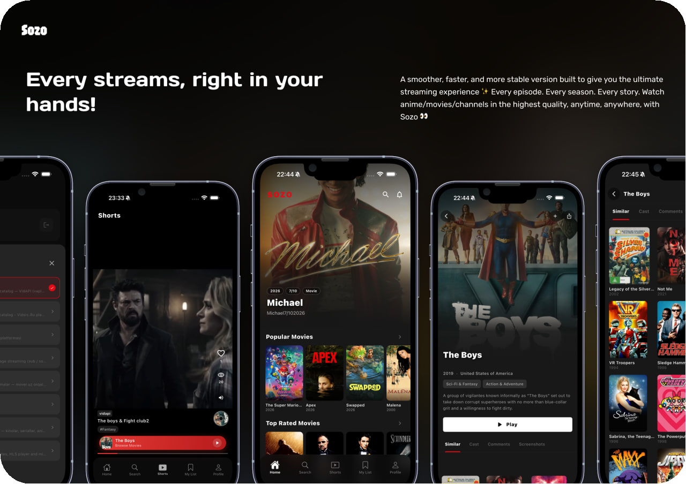
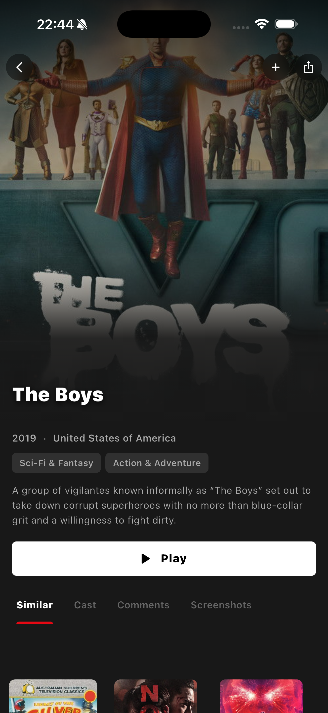
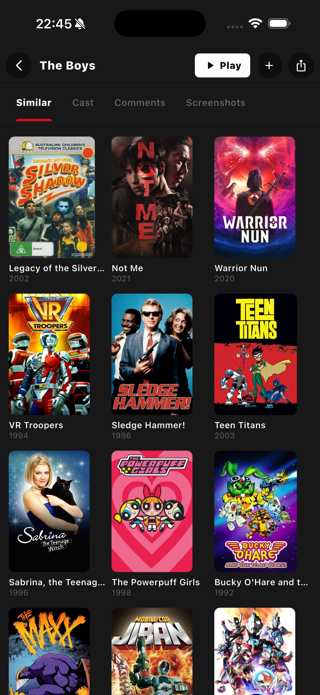
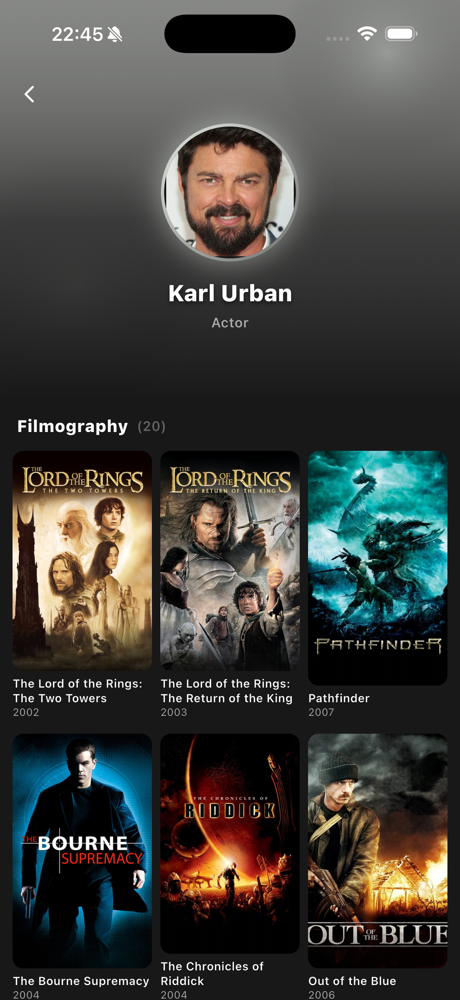
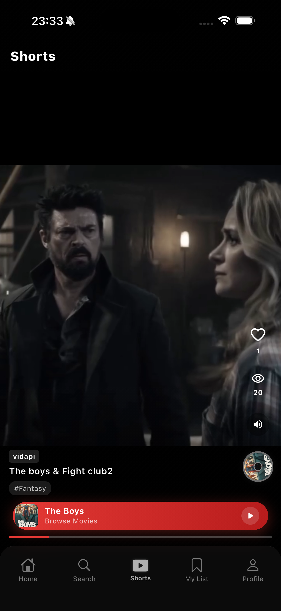
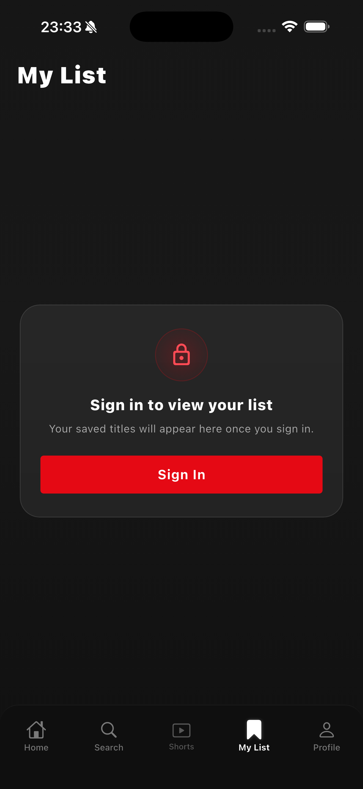

  

  <h1>Sozo</h1>
  
A modern Flutter streaming app for movies, series, and anime.

  

    
    
    
  

## About

Sozo is built around a simple, elegant streaming experience for discovering, watching, and downloading content. The name Sozo means "creation" or "imagination" in Japanese, matching the app's anime-inspired identity and polished dark interface.

## Highlights

- Discover movies, series, and anime from a clean home feed.
- Explore details, cast, related titles, and screenshots before watching.
- Watch with subtitles, episodes, quality options, and picture-in-picture.
- Save favorites, continue from watch history, and download for offline use.
- Enjoy shorts, dark visuals, and a smooth mobile-first experience.

## Screenshots

  
  
  

  
  
  

## Community

Follow the project website or join the community to share feedback, report issues, and discuss upcoming features.
